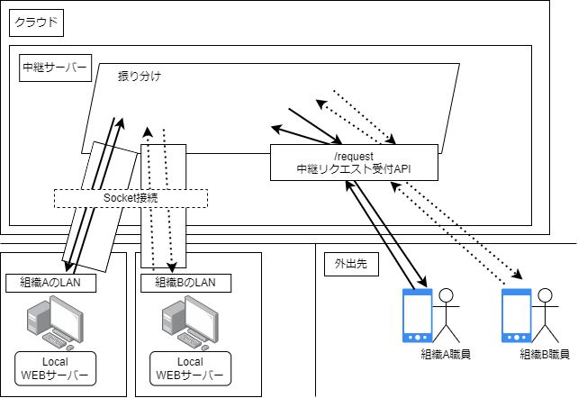

# XMLHttpRequest中継  

## 概要  
ソケット通信を用いて、ローカルのWEBサーバーのデータを外部からアクセスできるようにする機能を提供します。  

## 仕組み  
  
組織A、組織B各々のLAN上にWEBサーバーが有ります。  
クラウド上の中継サーバーとSocket接続します。  
外出先にいる組織A、組織Bの職員が中継サーバーにXMLHttpRequest(以下、中継リクエスト)を発行します。  
中継リクエストには、組織を識別する組織IDと、リクエスト内容が含まれています。  
中継サーバーは組織IDを見て、該当のSocket接続にリクエストをメッセージの形で送信します。  
ローカルサーバーはリクエストに応じてレスポンスを中継サーバーにメッセージの形で送信します。  
中継サーバーはローカルサーバーから送られたデータを返信します。  

## クラス
下記で説明するクラスですが、githubリポジトリからインストール可能です。
```bash
npm install yamadash82/reqeust-repeater
```

またGithub Packagesでも航海しています。  
Githubアカウントを持たれている場合`read:packages`のついたトークンを取得し、`.npmrc`ファイルを`package.json`と同じ階層に置くことでGithub packagesからインストールすることも可能です。
```:.npmrc
@yamadash82:registry=https://npm.pkg.github.com/
//npm.pkg.github.com/:_authToken=<トークン>
```
Github Packagesからインストールする。  
```bash
npm install --save @yamadash82/request-repeater
```

### **RequestRepeater**  
中継サーバーとローカルサーバーの接続部分を抽象化したクラスです。  
中継サーバー側で使用します。  
中継サーバーとローカルサーバー間のSocket接続を保持し、中継サーバーからローカルサーバーへのリクエストデータの送信、対応するレスポンスデータの受信部分を扱います。  

| プロパティ名 | 型 | 説明 | 
| :- | :- | :- |
| public readonly organizationId | string | 接続を識別するID |
| private socket | Socket | Socket.ioのインスタンス |

| メソッド名 | 戻り値 | 説明 |
| :- | :- | :- |  
| public new(socket: Socket) | RequestRepeater | コンストラクタ |
| public send(parameter: RepeatRequestParameter\<any\>) | Promise\<any\> | parameterで設定した内容をローカルサーバーに送信し、ローカルサーバーからのレスポンスを返す。| 

### **RequestRepeatersController**  
中継サーバー側で使用します。  
複数の`RequestRepeater`を保持し、外部からローカルサーバーへのリクエスト要求を受けたとき、該当する`RequestRepeater`を見つけてリクエストの送信を行います。  

| プロパティ名 | 型 | 説明 |
| :- | :- | :- |
| private repeaters | RequestRepeater[] | `RequestRepeater`のインスタンス群 |

| メソッド名 | 戻り値 | 説明 |
| :- | :- | :- |
| public new() | RequestRepeatersController | コンストラクタ |
| public find(organizationId: string) | RequestRepeater \| null | 指定した`organizationId`の`RequestRepeater`オブジェクトを検索する。見つからなかった場合nullを返す。|
| public add(socket: Socket) | void | 引数で指定した`Socket`オブジェクトより`RequestRepeater`オブジェクトを生成し、`repeaters`プロパティに追加する。|
| public add(repeater: RequestRepeater) | void | 引数で指定した`RequestRepeter`オブジェクトを`repeaters`プロパティに追加する。|
| public remove(organizationId: string) | void | 引数で指定した`organizationId`の`RequestRepeater`オブジェクトを`repeaters`プロパティから除外する。|
| public send(parameter: RepeatRequest\<any\>) | Promise\<any\> | 引数で受け取った`RepeatRequest`オブジェクトをもとに、該当する`RequestRepeater`を見つけて、ローカルサーバーにリクエストを送信する。ローカルサーバーからのレスポンスを返す。|  

### **RepeatRequest\<PT\>**
中継サーバーに外出先から中継リクエストを送信する際の形式を表すクラスです。  
| プロパティ | 型 | 説明 |
| :- | :- | :- |
| public organizationId | string | ローカルサーバーとの接続を識別するIDである。 |
| public handlerId | string | ローカルサーバーで実行される処理を指定するIDである。 後述のローカルサーバー側で実行される処理`AbstractRepeatRequest`の指定に使用する。|
| public parameter | any | リクエストに付随して送信するパラメータが有れば、ここにセットする。|
使用例  
```json
{
  "organizationId": "organization001", 
  "handlerId": "find-user-info", 
  "parameter": {
    "userId": 1234
  }
}
```

### **RepeatRequestReceiver**  
ローカルサーバ側で使用します。  
ローカルサーバー側から見た中継サーバーとの接続を表すクラスです。  
中継サーバーから送られるリクエストに対し、対応の処理を実行しレスポンスを返します。  

| プロパティ | 型 | 説明 |
| :- | :- | :- |
| private requestHandlers | AbstractRepeatRequestHandler\<any, any\> | 中継サーバーから送られたリクエストに対するイベントハンドラ群である。|

| メソッド | 戻り値 | 説明 |
| :- | :- | :- |
| public new(socket: Socket) | RepeateRequestReceiver | コンストラクタである。引数に`Socket`オブジェクトを指定する。|
| public setHandeler(repeatRequest: AbstractRepeatRequestHandler\<any, any> | void | 引数で指定した`AbstractRepeatRequestHandler`オブジェクトを`requestHandlers`プロパティに追加する。|
| public setHandeler(repeatRequests: AbstractRepeatRequestHandler\<any, any>[] | void | 引数で指定した複数の`AbstractRepeatRequestHandler`オブジェクトを`requestHandlers`プロパティに追加する。 |

### **AbstractRepeatRequestHandler\<PT, RT>**  
ローカルサーバー側で使用する。  
中継サーバーから受信したリクエストデータを受けて実行するイベントハンドラを抽象化したクラスです。  
抽象クラスです。  

| プロパティ名 | 型 | 説明 |
| :- | :- | :- |
| public readonly handlerId | string | イベントハンドラを識別するID |

| メソッド名 | 戻り値 | 説明 |
| :- | :- | :- |
| public abstract getResponse(parameter: PT) | RT \| Promise\<RT> | リクエストに対するレスポンス生成処理。パラメータ指定あり。|
| public abstract getResponse() | RT \| Promise\<RT> | リクエストに対するレスポンス生成処理。パラメータ指定なし。|  

## 使用方法  
### Express編
Expressフレームワークでの使用例を示します。  
コード全容は当リポジトリの`example/use-express`ディレクトリを参照してください。  
#### 中継サーバー(クラウド)側  

##### 1. サーバーインスタンスの生成
`Express`フレームワークと、`socket.io`ライブラリを利用してサーバーインスタンス、`ReqeustRepeatersController`のインスタンスを生成します。  

```typescript:cloud-server/server.ts
import Express from 'express';
import { createServer } from 'http';
import { Server } from 'socket.io';
import { 
  RepeatRequest, 
  RequestRepeatersController, 
  AlreadyConnectedException, 
} from '@yamadash82/request-repeater';

const app = Express();
...

const repeatersController = new RequestRepeatersController(); //←

const httpServer = createServer(app);

const io = new Server(httpServer);

httpServer.listen(3000)
```
**注意**
`app.listen(3000, () => { })`ではありません。  
> **Caution**  
> Using `app.listen(3000)` will not work here, as it creates a new HTTP server.  
> https://socket.io/docs/v4/server-initialization/ より引用  

##### 2. `RequestRepeaer`オブジェクトの生成
ソケット接続時に`RequestRepeaer`オブジェクトを生成します。  
```typescript:cloud-server.ts
io.on('connection', (socket) => {
  try {
    //addメソッドで、socketオブジェクトを元にRequestRepeterを生成しています。
    repeatersController.add(socket);

    //ソケット切断時のイベントハンドラを登録します。
    socket.on('disconnect', (reason) => {
      //RequestRepeatersControllerの保持するRequestRepeater群から該当のRequestRepeaterを除外します。
      repeatersController.remove(socket.handshake.auth.organizationId);
    });
  } catch (err) {
    if (err instanceof AlreadyConnectedException) {
      //既に接続済み状態で、接続要求があった場合の処理。
      console.error(`${err.message}接続を維持します。`);
    } else {
      //それ以外の例外時、切断する。
      socket.disconnect();
      console.log(`サーバサイドでエラー:${err}`);
    }
  }
});
```

##### 3. 外出先からリクエストを受け付けるルーティングの作成  
外出先からローカルサーバーへのリクエストを受け付けるルーティングを作成します。  
```typescript:cloud-server/server.ts
app.post('/request-repeat', async (req, res) => {
  const body: RepeatRequest<any> = req.body;
  
  try {
    //RequestRepeatersController#sendメソッドで、該当のローカルサーバーにリクエストを転送し、レスポンスを取得します。
    const resData = await repeatersController.send(body);

    return res.json(resData);
  } catch(err) {
    return res.json(err instanceof Error ? err.message : 'リクエスト中継処理でエラーが発生しました。');
  }
});
```
このルーティングに送るデータは`RepeatRequest`型です。  
```json
{
  "organizationId": "organization001", 
  "handlerId": "find-user-info", 
  "parameter": {
    "userId": 1234
  }
}
```
- organizationId
    このリクエストデータが送信される先を指定します。  
- handlerId
    ローカルサーバーで処理するハンドラを指定します。  
- parameter
    ローカルサーバーに送信するリクエストに付随するパラメータがある場合、指定します。  

#### ローカルサーバー側  
##### 1. ローカルサーバーインスタンスの生成  
ローカルサーバーインスタンスと、テスト用ルーティングを作成します。  
```typescript:local-server/server.ts
import Express from 'express';

const app = Express();

//テストデータ
const users: { userId: number, userName: string }[] = [
  { userId: 1, userName: '山田　太郎' }, 
  { userId: 2, userName: '山田　二朗' }, 
  { userId: 3, userName: '山田　花子' }
];

app.get('/fetch-users-list', (req, res) => {
  return res.json(users);
});

app.listen(8080, () => {
  console.log('local server runnning on port:8080.');
});
```
このコードをビルドして実行し、`http://localserver:8080/fetch-users-list`にアクセスすると、`users`の内容が返されます。Node.jsサーバーにおける通常の処理です。  

#### 2. 中継サーバーから中継リクエストがあった際のイベントハンドラの作成  
外出先からローカルサーバーへのGetリクエストに対応する例を示します。  
`AbstractRepeatRequet`を継承して作成します。  
外出先から中継サーバーを経由して以下のようなリクエストデータが送られてくるとします。  
```json
{
  "organizationId": "organization001", 
  "handlerId": "get-request", 
  "parameter": {
    "url": "http://localhost:8080/fetch-users-list"
  }
}
```
このデータはローカルサーバ内で指定したurlにGetリクエストを発行してレスポンスを得ることを期待しています。  
対応する処理を生成します。  

```typescript:local-server/server.ts
import SupserAgent from 'supseragent';

class GetRequestParameter {
  url!: string;
  parameter!: any
}

export class RepeatGetRequestHandler<RT> extends AbstractRepeatRequestHandler<GetRequestParameter, RT> {
  getResponse(parameter: GetRequestParameter): RT | Promise<RT>;
  getResponse(): RT | Promise<RT>;
  async getResponse(parameter?: any): Promise<RT> {
    if (!parameter) throw new Error('GetRequestParameter型のパラメータが設定されていません。');
    
    try {
      const url: string = parameter.url;

      const res = await SuperAgent(url).query(parameter.parameter);
      
      return res.text as RT;
    } catch(err) {
      throw err;
    }
  }
}
```
xmlHttpRequestの発行に`superagent`ライブラリを使用します。  
`GetRequestParameter`は`RepeatRequest#parameter`の型を指定します。  
前述の中継リクエストの  
```json
{
  ...
  "parameter": {
    "url": "http://localhost:8080/fetch-users-list"
  }
}
```
"parameter"プロパティの型が`GetRequestParameter`であることを定義しています。  

`RepeatGetRequestHandler`は抽象クラス`AbstractRepeatRequestHandler`を継承し、`getResponse`メソッドを実装します。  
メソッド内で`xmlHttpRequest`を発行し、取得したレスポンスデータを返します。  
リクエストデータにあるurlパラメータですが、ローカルサーバ内でのurlを指定しています。  

##### 3. ソケット開通時にRequestReceiverオブジェクトの作成とイベントハンドラの登録  
```typescript:local-server/server.ts
let requestReciever: RepeatRequestReceiver;
let socket: Socket;

app.get('/connect', async (req: Express.Request, res: Express.Response, next: Express.NextFunction) => {
  try {
    //中継サーバーとのソケット接続を取得する。
    socket = io('http://localhost:3000', {
      auth: {
        //組織ID
        organizationId: 'organization001'
      }
    });

    await (async () => {
      return new Promise<boolean>((resolve, reject) => {
        socket.on('connect', () => {
          console.log(`接続成功`);
          return resolve(true);
        });
    
        socket.on('connect_error', (err) => {
          console.log(`接続失敗:${err}`);
          socket.disconnect();
          return reject(err);
        });
      })      
    })();

    setTimeout(() => {
      socket.on('disconnect', () => {
        console.log('切断');
      });
    });

    requestReciever = new RepeatRequestReceiver(socket);

    requestReciever.setHandler(new RepeatGetRequestHandler<any>('get-request'));

    res.send('中継サーバーに接続');
  } catch(err) {
    res.send('中継サーバーに接続中にエラーが発生しました。' + (err instanceof Error ? err.message : ''));
  }
});
```
`http://localhost/connect`にアクセスしたとき、中継サーバーとSocket接続し、Socketを元に`ReqeustReceiver`オブジェクトを生成します。  
Socket接続を取得する部分で、組織IDを記述している箇所、当例ではリテラルで`organization001`をセットしていますが、複数のローカルサーバーを接続する場合は、動的に変えるなどして、重複しないようにしてください。 
socketの切断時のイベントハンドラを設定している部分ですが、setTimeoutを用いないとイベントが捕捉されませんでした。
```typescript
//×
socket.on('disconnect', () => {
  console.log('切断');
});

//○
setTimeout(() => {
  socket.on('disconnect', () => {
    console.log('切断');
  });
});
```
先述したイベントハンドラクラスを登録している部分です。イベントハンドラ名`get-request`を指定して登録します。  
```typescript
requestReciever.setHandler(new RepeatGetRequestHandler<any>('get-request'));
```

#### 動作確認  
当リポジトリの内容で動作確認する手順を示します。  
```bash
# ディレクトリを移動して実行します。
cd examples/use-express
npm install

# ディレクトリ移動して実行します。
cd examples/use-express/cloud-server
npm install
npm run build
npm start

# 別ターミナルを開き実行します。
cd examples/use-express/local-server
npm install
npm run build
npm start
```

当方はThanderClientを使用してテストしました。  
1. ローカルサーバーを中継サーバーに接続  
    `http://localhost:8080/connect`にGETリクエストを発行します。
1. 中継サーバーにPOSTリクエストを発行  
    `http://localhost:3000/request-repeat`にPOSTリクエストで下記内容を送信します。  
    ```json
    {
      "organizationId": "organization001", 
      "handlerId": "get-request", 
      "parameter": {
        "url": "http://localhost:8080/fetch-users-list"
      }
    }
    ```
    下記のレスポンスが取得できれば成功です。  
    ```
    "[{\"userId\":1,\"userName\":\"山田　太郎\"},{\"userId\":2,\"userName\":\"山田　二朗\"},{\"userId\":3,\"userName\":\"山田　花子\"}]"
    ```

### NestJS編  
NestJSフレームワークでの使用例を示します。  
コード全容は当リポジトリの`example/use-nestjs`ディレクトリを参照してください。  

#### 中継サーバー側  

```typescript:src/events/gateway.ts
import { 
  WebSocketGateway,  
  OnGatewayConnection, 
  OnGatewayDisconnect, 
} from '@nestjs/websockets';
import { RequestRepeatersController, RepeatRequest } from '@yamadash82/request-repeater';
import { Socket } from 'socket.io';
import { Logger } from '@nestjs/common';

@WebSocketGateway({
  cors: { origin: '*' }
})
export class EventsGateway implements OnGatewayConnection, OnGatewayDisconnect {
  private repeatersController = new RequestRepeatersController();

  handleConnection(socket: Socket) {
    try {
      //中継器を追加する。
      this.repeatersController.add(socket);
      Logger.log(`${socket.handshake.auth.organizationId}が接続しました。`);
    } catch(err) {
      Logger.error(`RequestRepeaterインスタンス追加処理中にエラーが発生しました。`, `EventsGateway#handleConnection`);
    }
  }

  handleDisconnect(socket: Socket) {
    try {
      const organizationId = socket.handshake.auth.organizationId;
      this.repeatersController.remove(organizationId);
      Logger.log(`${organizationId}が切断しました。`);
    } catch(err) {
      Logger.error('RequestRepeaterインスタンス削除処理中にエラーが発生しました。', `EventsGateway#handleDisconnect`);
    }
  }

  //リクエスト中継処理
  async repeatRequest<RT>(request: RepeatRequest<any>): Promise<RT> {
    try {
      return this.repeatersController.send(request);
    } catch(err) {
      throw err;
    }
  }
}
```

- `handleConnection`メソッド
    WebSockets接続時に実行されるメソッドです。  
    引数で渡される`Socket`オブジェクトを元に`RequestRepeater`オブジェクトを生成し、`RequestRepeatersController`オブジェクトに追加します。  

- `handleDisconnect`メソッド
    WebSockets切断時に実行されるメソッドです。  
    `RequestRepeatersController`オブジェクトから該当の`RequestRepeaters`を除外します。  

- `repeatRequest`メソッド  
  後述の中継サーバーへのXMLHttpRequestで送られてきたデータを、WebSocktes接続を使って、ローカルサーバーに転送し、ローカルサーバーからの返却値を返します。  

#### ローカルサーバー側  
##### 1.テスト用ルーティングの作成  
例としてダミーのユーザー情報を取得するルーティングを作成します。  

サービス  
```typescript:src/users/users.service.ts
import { Injectable } from '@nestjs/common';

export class User {
  userId: number;
  userName: string;
}

@Injectable()
export class UsersService {
  private users: User[] = [
    { userId: 1, userName: '山田　太郎' }, 
    { userId: 2, userName: '山田　花子' }, 
    { userId: 3, userName: '佐藤　二朗' }, 
  ];

  fetchUserList(): User[] {
    return this.users;
  }

  findUser(query: { userId: number }): User | null {
    const parsedUserId = parseInt(query.userId.toString());
    return this.users.find(user => user.userId === parsedUserId) || null;
  }
}
```  
コントローラー  
```typescript:src/users/users.controller.ts
import { Controller, Get, Query } from '@nestjs/common';
import { UsersService, User } from './users.service';

@Controller('users')
export class UsersController {
  constructor (
    private users: UsersService
  ) { }

  @Get('fetch-users-list')
  fetchUsersList(): User[] {
    return this.users.fetchUserList();
  }

  @Get('find')
  findUser(@Query() query: { userId: number }): User | null {
    return this.users.findUser(query);
  }
}
```
これで、ローカルサーバーを実行し、`http://localhost:8080/users/fetch-users-list`にアクセスするとユーザー一覧が返されます。これは通常のXMLHttpRequestの動作です。  

##### 2.中継処理の作成  
`中継サーバー`と`WebSokets`接続し、中継リスクエスの受信、レスポンスの返却を行う処理を示します。  
サービス  

```typescript:src/repeat-request/repeat-request.service.ts
import { Injectable, Logger } from '@nestjs/common';
import { io, Socket } from 'socket.io-client';
import { RepeatRequestReceiver, AbstractRepeatRequestHandler } from '@yamadash82/request-repeater';
import * as SuperAgent from 'superagent';

@Injectable()
export class RepeatRequestService {
  private requestReceiver!: RepeatRequestReceiver;
  
  //WebSockets接続
  async connect(): Promise<boolean> {
    try {
      const url = 'http://localhost:3000';
      
      const socket = io(url, {
        auth: {
          organizationId: 'organization001', 
          password: 'abc123'
        }
      });

      this.requestReceiver = new RepeatRequestReceiver(socket);

      socket.on('disconnect', reason => {
        Logger.log(`中継サーバーとの接続を解除しました。${reason}`, `RepeatRequestService#connect`);
      });

      await (async () => {
        return new Promise<boolean>((resolve, reject) => {
          //接続時
          socket.on('connect', () => {
            Logger.log('中継サーバーとの接続に成功しました。', `RepeatRequestService#connect`);
            return resolve(true);
          });

          //接続エラー時
          socket.on('connect_error', err => {
            return reject(err);
          })
        });
      })();

      this.setHandler();

      return true;
    } catch(err) {
      Logger.error(`中継サーバーとの接続処理中にエラーが発生しました。${err instanceof Error ? err.message : ''}`, `RepeatRequestService#connect`);
      
      return false;
    }
  }

  setHandler() {
    this.requestReceiver.setHandler(new RepeatGetRequestHander<any>('get-request'));
  }
}

class GetRequestParameter {
  url: string;
  parameter: any
}

export class RepeatGetRequestHander<RT> extends AbstractRepeatRequestHandler<GetRequestParameter, RT> {
  getResponse(parameter: GetRequestParameter): Promise<RT>;
  getResponse(): Promise<RT>;
  async getResponse(parameter?: any): Promise<RT> {
    Logger.log(`中継リクエストを受信しました。`, `RepeatGetRequestHandler#getResponse`);
    if (!parameter) throw new Error(`GetRequestParameter型のパラメーターが設定されていません。`);
    try {
      const url = parameter.url;
      const res = await SuperAgent(url).query(parameter.parameter);
      
      return res.text as RT;
    } catch(err) {
      throw err;
    }
  }
}
```

- `connect`メソッド  
  `中継サーバー`と`WebSockets`接続する処理を行います。  
- `setHandler`メソッド  
  `中継リクエスト`に含まれる`handlerId`に対応した処理を定義し、追加します。  

`GetRequestParameter`クラス、`RepeatGetRequestHandler`クラスについては、前述の`Express編`を参照ください。  

#### 動作確認  
当リポジトリの内容で動作確認する手順を示します。  
```bash
# 中継サーバー側のビルド
cd example/use-nestjs/cloud-server
npm install
npm run start:dev

# ローカルサーバー側のビルド
cd example/use-nestjs/local-server
npm install 
npm run start:dev
```
当方はThunderClientを使用してテストしました。  
1. ローカルサーバーを中継サーバーに接続  
    `http://localhost:8080/connect`にGETリクエストを送信します。  
1. 中継サーバーにPOSTリクエストを発行  
    `http://localhost:3000/repeat-request`にPOSTリクエストを送信します。BODYに以下のデータを指定します。  
    ```json
    { 
      "organizationId": "organization001", 
      "handlerId": "get-request", 
      "parameter": {
        "url": "http://localhost:8080/users/find", 
        "parameter": {
          "userId": 1
        }
      }
    }
    ```
    以下のレスポンスが受信できれば成功です。  
    ```json
    {
      "succeed": true,
      "errorMessage": "",
      "body": "{\"userId\":1,\"userName\":\"山田　太郎\"}"
    }
    ```

以上です。